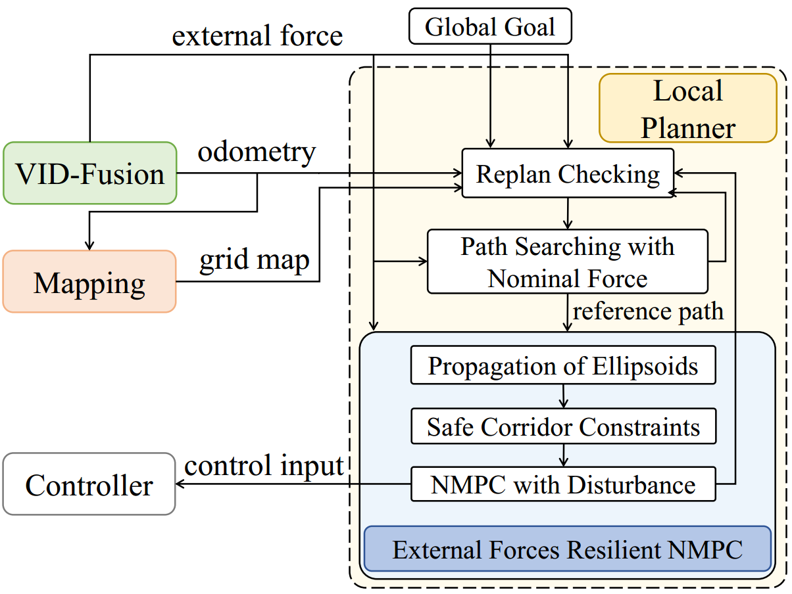
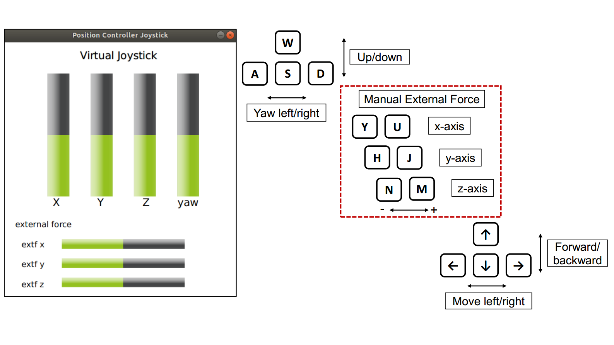

# External Forces Resilient Planner

External Forces Resilient Safe Motion Planning for Quadrotor
 

##  About

 External Forces Resilient Planner is a systematic framework to achieve robust local planning, which accounts for the influence of extreme external disturbance.


<p align="center">
  
  
  
  
</p>


__Authors__: [Yuwei WU](https://www.seas.upenn.edu/~yuweiwu/)  and [Fei GAO](https://ustfei.com/) from the [ZJU Fast Lab](http://www.kivact.com/).

__Video Links__:  [youtube](https://youtu.be/nSKbzAM0v18) or [bilibili](https://www.bilibili.com/video/BV1eX4y137vn/) (for Mainland China)

__Related Paper__: [arxiv](https://arxiv.org/pdf/2103.11178.pdf)


__Architecture__:
<p align="center">
  
</p>


If this repo helps your research, please cite our paper at:
```bibtex
@article{wu2021external,
  title={External Forces Resilient Safe Motion Planning for Quadrotor},
  author={Wu, Yuwei and Ding, Ziming and Xu, Chao and Gao, Fei},
  journal={arXiv preprint arXiv:2103.11178},
  year={2021}
}
```

##  Acknowledgements

- ***Simulators*** : we use [RotorS](https://github.com/ethz-asl/rotors_simulator) as our simulation environment.
- ***NMPC Solver*** ：[Forces Pro](https://www.embotech.com/products/forcespro/overview/) is applied to automatically generate c library to solve nonlinear Model Predictive Control. Thanks [mrca-mav](https://github.com/tud-amr/mrca-mav) as the example about how to use Forces Pro for MPC.
- ***External Force Estimator***: we use [VID-Fusion](https://github.com/ZJU-FAST-Lab/VID-Fusion) to get external force.
- ***Corridor Generator*** ：We use [Galaxy](https://github.com/ZJU-FAST-Lab/Galaxy) by Xingguang to generate corridor directly on point clouds in our paper and the code will be released after publication of this paper. Now we use [MRSL Decomp Util ROS](https://github.com/sikang/DecompROS) by sikang to replace this part. 
- ***Front-end Framework***: The occupancy map is based on [TGK-Planner](https://github.com/ZJU-FAST-Lab/TGK-Planner), and the front-end path searching is revised on the framework of [Fast-Planner](https://github.com/HKUST-Aerial-Robotics/Fast-Planner).

# Run The Simulation
The repo has been tested on 18.04 with ros-desktop-full installation.

## 1. Prerequisites

#### [RotorS](https://github.com/ethz-asl/rotors_simulator)

Follow the instructions and create a new catkin workspace at ``${YOUR_ROTORS_WORKSPACE_PATH}`` for Rotor Simulator (use catkin build). We make some revisions on this repository to fit our planner, and you can check the repo () for more details.

#### [Forces Pro](https://www.embotech.com/products/forcespro/overview/) and MATLAB 

Firstly, you should request an academic license [here](https://www.embotech.com/products/forcespro/licensing/). 
You can directly use the compiled version in this repo for testing. And if you want to change settiings of the NMPC solver, you need to use matlab on ubuntu to automatically regenerate it and replace the previous generated code.

After you build on ROS, you can find the folder ``src/resilient_planner/plan_manage/matlab_code``. In matlab terminal, run ``genearate_solver.m``, then re-build in the workspace and you can get the newly generated code in the folder ``src/resilient_planner/plan_manage/solver`` for useage.

## 2. Build on ROS

Clone the repo:
```
git clone https://github.com/ZJU-FAST-Lab/forces_resilient_planner
cd forces_resilient_planner/src/ThirdParty
git clone https://github.com/ZJU-FAST-Lab/VID-Fusion
cd ../..
catkin_make
```

## 3. Run

In ``${YOUR_ROTORS_WORKSPACE_PATH}``, set up the environment and launch the planner:
```
source devel/setup.bash
roslaunch rotors_gazebo fast_with_vi_sensor.launch
```

Then you will see the default map in the gazebo GUI, while the quadrotor is on the ground.

Second, set up VID-Fusion in our workspace, 

```
source devel/setup.bash
roslaunch vid_estimator vid_sim.launch
```

Then you can use the keyboard to move the quadrotor for VID-Fusion initializations. For details about the estimator setup, please carefully read the documents of VID-Fusion.

<p align="center">
  
</p>

In addition, you can also use the keyboard to add manual external disturbance in different directrions.


In directory ``~/forces_resilient_planner``, open a new terminal and launch the resilient planner:
```
source devel/setup.bash && roslaunch resilient_planner rotor_sim.launch
```

If everything goes well, you should be able to navigate the drone as the gif shows below.


# Licence
The source code is released under [GPLv3](http://www.gnu.org/licenses/) license.

# Maintaince
The peoject is under maintaince.

For any technical issues, please contact Yuwei Wu (yuweiwu@seas.upenn.edu, yuweiwu20001@outlook.com) or Fei GAO (fgaoaa@zju.edu.cn).
